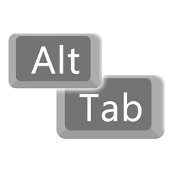

<p align="center">
  
</p>

<h1 align="center">TrueAltTab</h1>

<p align="center">Minimiza los juegos de verdad y no deja que se restauren solos.</p>

<p align="center">
  <a href="https://github.com/Leshugan/TrueAltTab/releases/latest"></a>
  <a href="https://github.com/Leshugan/TrueAltTab/releases"></a>
  
  
  <a href="LICENSE"></a>
</p>

<p align="center">
  <a href="https://github.com/Leshugan/TrueAltTab/releases/latest/download/TrueAltTab.exe"><b>⬇ Descargar TrueAltTab.exe</b></a>
</p>

<p align="center"><a href="README.md">English</a> · <a href="README.ru.md">Русский</a> · <b>Español</b></p>

---

## Por qué

Minimizar un juego en Windows puede ser un dolor de cabeza. Algunos juegos no se
minimizan en absoluto y se quedan encima de todo. Otros se minimizan, pero vuelven
a aparecer un segundo después en cuanto abres el navegador o el Explorador.
Otros salen de pantalla completa y se quedan como una ventana.

TrueAltTab recupera el comportamiento de Windows 7: sales del juego — el juego
se minimiza y se queda así hasta que tú mismo lo abras.

## Qué hace

- **Minimiza el juego** cuando sales de él: Alt+Tab, Win+Tab, Win (menú Inicio),
  Win+D, Ctrl+Shift+Esc, Ctrl+Alt+Supr, pantalla de bloqueo.
- **Lo mantiene minimizado.** Si el juego intenta volver por sí solo, el programa
  lo oculta de nuevo al instante. Solo tú puedes abrirlo: con Alt+Tab, Win+Tab
  o su botón en la barra de tareas.
- **Se encarga de los juegos rebeldes.** Si un juego no se minimiza de la forma
  normal, el programa prueba métodos cada vez más contundentes. Si el juego sale
  de pantalla completa en lugar de minimizarse, o no se minimiza en absoluto,
  el programa lo pone detrás de las demás ventanas y le quita el foco.
- **Protege el juego del robo de foco.** Si otro programa aparece sobre el juego
  sin que pulses nada, el foco vuelve al juego.
- **Esquiva el error de Windows 11** que hace que los juegos pierdan el foco en cada clic.
- **Se adapta a cada juego por sí solo.** Si un juego se cierra al minimizarlo o
  insiste en volver, el programa lo recuerda y a partir de entonces lo oculta sin
  minimizarlo. No hace falta configurar nada.

## Qué no hace

- No se inyecta en los juegos ni modifica sus archivos — seguro con los antitrampas.
- No pulsa teclas por ti.
- No escribe en el registro ni cambia nada en Windows. Cierras el programa —
  todo queda como estaba.
- No intercepta ni bloquea tus atajos. Alt+Tab y los demás funcionan como siempre.

## Instalación

Descarga `TrueAltTab.exe`, ponlo en cualquier carpeta y ejecútalo. Aparecerá un icono
en la bandeja del sistema.

Menú del icono (clic derecho):
- **Pausa** — desactivarlo temporalmente.
- **Iniciar con Windows** — inicio automático mediante el Programador de tareas.
- **Guardar registro** — activar o desactivar el registro.
- **Abrir registro**
- **Salir**

El programa se ejecuta como administrador — sin eso Windows no le deja controlar
juegos que se ejecutan como administrador.

## Windows Defender

Windows Defender o SmartScreen pueden mostrar una advertencia sobre el programa
o incluso eliminarlo. Es una falsa alarma. Por qué ocurre:

- **El programa no tiene firma digital.** Un certificado de firma cuesta dinero cada
  año y el programa es gratuito. SmartScreen recibe un exe sin firmar de un autor
  desconocido con la ventana «Windows protegió su PC».
- **El programa se comporta un poco como un programa espía, aunque no lo es.**
  Se ejecuta como administrador, vigila los cambios de ventana, detecta pulsaciones
  y clics, y puede añadirse al inicio automático. Defender no sabe para qué — solo
  ve un conjunto de acciones habitual en el malware.

Lo que demuestra lo contrario:

- El programa solo recuerda **cuándo** se pulsan las teclas, no cuáles. No guarda
  nada ni envía nada a ningún sitio — no tiene ningún código de internet.
- No se inyecta en otros programas ni modifica archivos ni el registro.
- El código fuente es abierto: puedes leerlo y compilar el exe tú mismo.
- Puedes comprobar el exe en [VirusTotal](https://www.virustotal.com).

Si SmartScreen muestra una advertencia, pulsa **«Más información» → «Ejecutar de todas formas»**.
Si Defender eliminó el archivo, restáuralo en «Historial de protección» y añade
la carpeta del programa a las exclusiones.

## Idioma

Ruso, inglés y español. Por defecto usa el idioma de Windows. Para elegirlo
manualmente, pon `Language = es` (o `ru`, `en`, `auto`) en `TrueAltTab.ini`.

## Archivos

- `TrueAltTab.ini` junto al exe — idioma, registro, la lista de programas que nunca
  se tocan y la lista de juegos que se ocultan sin minimizar (esta la mantiene
  el propio programa).
- `TrueAltTab.log` en el escritorio — registro de qué juego era, qué hizo y cómo
  se minimizó. Se puede desactivar en el menú. Si algo sale mal, activa el registro
  y adjúntalo a tu reporte.

## Requisitos

Windows 10 / 11, 64 bits.

## Compilar desde el código fuente

Necesitas [Rust](https://rustup.rs) y mingw-w64:

```
rustup target add x86_64-pc-windows-gnu
cargo build --release
```

Resultado: `target/x86_64-pc-windows-gnu/release/TrueAltTab.exe`.
O simplemente haz un fork — GitHub Actions compilará el exe por ti.

## Agradecimientos

La forma de seguir el foco de las ventanas sin tocar otros programas está inspirada
en [NoFocusSteal](https://github.com/BoazCohenJ/NoFocusSteal) (MIT).

## Licencia

[MIT](LICENSE)
